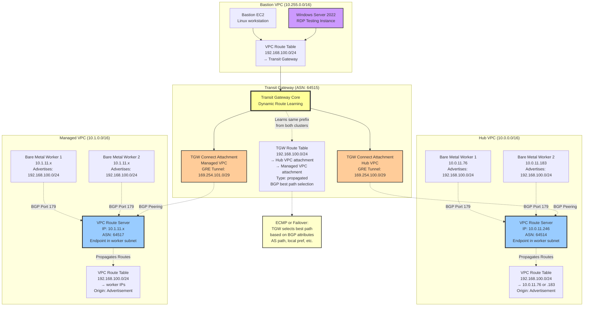
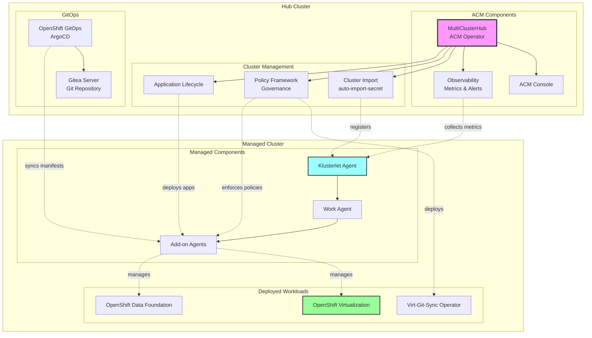
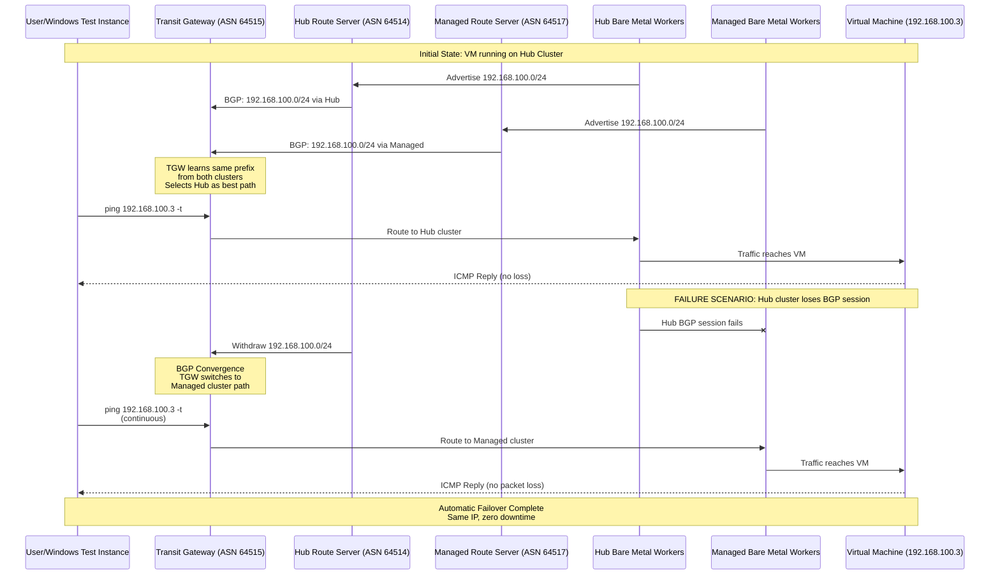
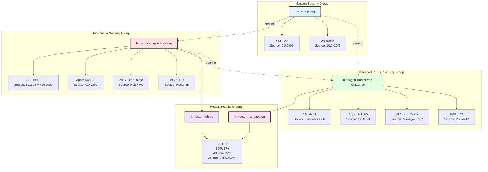
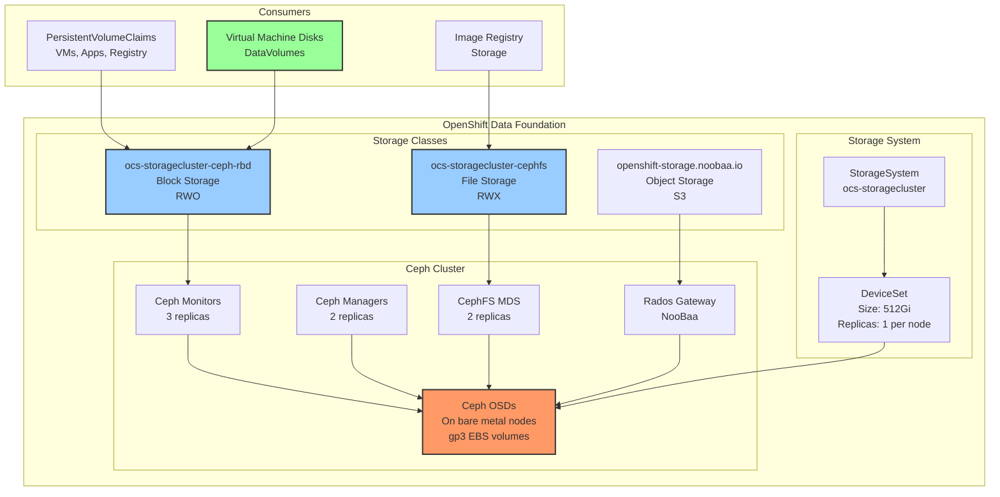

# Architecture Diagrams

## Overall Infrastructure Architecture with Transit Gateway and Route Servers

```mermaid
graph TB
    subgraph "AWS Region: us-east-1"
        subgraph "Bastion VPC (10.255.0.0/16)"
            Bastion[Bastion EC2<br/>RHEL 9]
            Windows[Windows Server 2022<br/>RDP Testing Instance]
            BastionRS[VPC Route Server<br/>ASN: 64516]
            BastionIGW[Internet Gateway]
            Bastion --> BastionIGW
            Windows --> BastionIGW
        end
        
        subgraph "Hub Cluster VPC (10.0.0.0/16)"
            subgraph "Public Subnets"
                HubPubA[10.0.1.0/24 us-east-1a]
                HubPubB[10.0.2.0/24 us-east-1b]
                HubPubC[10.0.3.0/24 us-east-1c]
            end
            
            subgraph "Private Subnets"
                HubPrivA[10.0.11.0/24 us-east-1a<br/>Workers + Route Server]
                HubPrivB[10.0.12.0/24 us-east-1b]
                HubPrivC[10.0.13.0/24 us-east-1c]
            end
            
            HubRS[VPC Route Server<br/>ASN: 64514<br/>Dynamic BGP Routing]
            HubNAT[NAT Gateway]
            HubIGW[Internet Gateway]
            
            subgraph "Hub OpenShift Cluster"
                HubMasters[Control Plane<br/>3x m5.xlarge]
                HubWorkers[Workers<br/>3x m5.2xlarge]
                HubBareMetal[Bare Metal Workers<br/>2x c5.metal<br/>Advertise CUDN via BGP]
            end
            
            HubBareMetal -.BGP Peering.-> HubRS
            HubBareMetal --> HubPrivA
            HubMasters --> HubPrivB & HubPrivC
            HubWorkers --> HubPrivA & HubPrivB & HubPrivC
            HubNAT --> HubPubA
            HubPubA --> HubIGW
            HubIGW --> Internet((Internet))
        end
       
        subgraph "Managed Cluster VPC (10.1.0.0/16)"
            subgraph "Public Subnets"
                MgdPubA[10.1.1.0/24 us-east-1a]
                MgdPubB[10.1.2.0/24 us-east-1b]
                MgdPubC[10.1.3.0/24 us-east-1c]
            end
            
            subgraph "Private Subnets"
                MgdPrivA[10.1.11.0/24 us-east-1a<br/>Workers + Route Server]
                MgdPrivB[10.1.12.0/24 us-east-1b]
                MgdPrivC[10.1.13.0/24 us-east-1c]
            end
            
            MgdRS[VPC Route Server<br/>ASN: 64517<br/>Dynamic BGP Routing]
            MgdNAT[NAT Gateway]
            MgdIGW[Internet Gateway]
            
            subgraph "Managed OpenShift Cluster"
                MgdMasters[Control Plane<br/>3x m5.xlarge]
                MgdWorkers[Workers<br/>3x m5.2xlarge]
                MgdBareMetal[Bare Metal Workers<br/>2x c5.metal<br/>Advertise CUDN via BGP]
            end
            
            MgdBareMetal -.BGP Peering.-> MgdRS
            MgdBareMetal --> MgdPrivA
            MgdMasters --> MgdPrivB & MgdPrivC
            MgdWorkers --> MgdPrivA & MgdPrivB & MgdPrivC
            MgdNAT --> MgdPubA
            MgdPubA --> MgdIGW
            MgdIGW --> Internet
        end
        
        subgraph "Transit Gateway (ASN: 64515)"
            TGW[Transit Gateway<br/>Dynamic Route Learning]
            TGWConnect1[TGW Connect<br/>Hub VPC<br/>GRE Tunnel]
            TGWConnect2[TGW Connect<br/>Managed VPC<br/>GRE Tunnel]
            
            TGW --> TGWConnect1
            TGW --> TGWConnect2
        end
        
        TGWConnect1 -.BGP Peering.-> HubRS
        TGWConnect2 -.BGP Peering.-> MgdRS
        TGW <--> Bastion
        TGW <--> HubMasters
        TGW <--> MgdMasters
        
    end
     
    User[User/Operator]
    User --> Bastion
    User -.RDP.-> Windows
    
    style HubBareMetal fill:#f96,stroke:#333,stroke-width:3px
    style MgdBareMetal fill:#f96,stroke:#333,stroke-width:3px
    style HubRS fill:#9cf,stroke:#333,stroke-width:3px
    style MgdRS fill:#9cf,stroke:#333,stroke-width:3px
    style BastionRS fill:#9cf,stroke:#333,stroke-width:2px
    style TGW fill:#ff9,stroke:#333,stroke-width:3px
    style Windows fill:#c9f,stroke:#333,stroke-width:2px
```



## VPC Route Server and Transit Gateway Connect BGP Architecture



## Legacy EC2 BGP Router Architecture (OPTIONAL - Superseded by VPC Route Server)

**Note:** This architecture using EC2-based FRR routers is kept for backwards compatibility.
New deployments should use VPC Route Server (see above) which provides native AWS BGP routing
without EC2 instances.

```mermaid
graph TB
    subgraph "Hub Cluster - Worker Node Internet Access via BGP Router"
        subgraph "Worker Nodes (10.0.11.0/24)"
            Workers[Worker Nodes<br/>m5.2xlarge + c5.metal<br/>Default Route: 10.0.11.1 (DHCP)]
            VPCRoute[VPC Route Table Override<br/>0.0.0.0/0 → BGP Router ENI]
            
            Workers --> VPCRoute
        end
        
        subgraph "BGP Router (10.0.11.111 + 10.0.1.X)"
            subgraph "Dual ENI Configuration"
                ENI1[ens5: 10.0.11.111<br/>Worker Subnet<br/>Primary Interface]
                ENI2[ens6: 10.0.1.X<br/>Public Subnet<br/>NAT Gateway Access]
            end
            
            RouterInstance[EC2 t3.small<br/>Amazon Linux 2023<br/>IP Forwarding: Enabled]
            
            subgraph "Routing Configuration"
                DefaultRoute[Default Route:<br/>0.0.0.0/0 via 10.0.1.178<br/>dev ens6]
                SystemdSvc[systemd service:<br/>bgp-router-routes.service<br/>Removes DHCP routes]
            end
            
            subgraph "NAT Configuration"
                MASQ[iptables NAT:<br/>MASQUERADE on ens6<br/>Persistent via iptables-services]
            end
            
            RouterInstance --> ENI1
            RouterInstance --> ENI2
            RouterInstance --> DefaultRoute
            RouterInstance --> SystemdSvc
            RouterInstance --> MASQ
        end
        
        VPCRoute --> ENI1
        ENI2 --> NAT[NAT Gateway<br/>10.0.1.178<br/>Public Subnet]
        NAT --> IGW[Internet Gateway]
        IGW --> Internet((Internet))
        
        subgraph "Traffic Flow"
            Flow1[1. Worker → VPC Route → Router ens5]
            Flow2[2. Router MASQUERADE → ens6]
            Flow3[3. Router ens6 → NAT Gateway]
            Flow4[4. NAT Gateway → Internet]
            
            Flow1 --> Flow2 --> Flow3 --> Flow4
        end
    end
    
    subgraph "Managed Cluster - Same Architecture"
        MgdWorkers[Workers: 10.1.11.0/24]
        MgdRouter[BGP Router:<br/>10.1.11.224 + 10.1.1.X<br/>Dual ENI Configuration]
        MgdNAT[NAT Gateway: 10.1.1.99]
        
        MgdWorkers --> MgdRouter
        MgdRouter --> MgdNAT
        MgdNAT --> Internet
    end
    
    style RouterInstance fill:#9cf,stroke:#333,stroke-width:3px
    style ENI1 fill:#f96,stroke:#333,stroke-width:2px
    style ENI2 fill:#9f9,stroke:#333,stroke-width:2px
    style MASQ fill:#ff9,stroke:#333,stroke-width:2px
```

## VM Network (CUDN) Architecture with Dynamic Failover

```mermaid
graph TB
    subgraph "Shared CUDN Network: 192.168.100.0/24"
        CUDN[Shared IP Range<br/>192.168.100.0/24<br/>Active-Active / Failover]
    end
    
    subgraph "Hub Cluster - VM Networking"
        subgraph "Bare Metal Nodes"
            BM1[Bare Metal Node 1<br/>10.0.11.76<br/>worker-cnv]
            BM2[Bare Metal Node 2<br/>10.0.11.183<br/>worker-cnv]
        end
        
        subgraph "OpenShift Virtualization"
            CNV[OpenShift Virtualization<br/>KubeVirt Operator]
            
            subgraph "NetworkAttachmentDefinition"
                NAD[vm-network<br/>Type: OVN Layer2<br/>ClusterUserDefinedNetwork]
            end
            
            subgraph "Virtual Machines"
                VM1[VM: test-vm-1<br/>192.168.100.3/24]
                VM2[VM: test-vm-2<br/>192.168.100.10/24]
            end
        end
        
        CNV --> VM1
        CNV --> VM2
        VM1 -.attached to.-> NAD
        VM2 -.attached to.-> NAD
        NAD --> BM1 & BM2
        
        HubRS[VPC Route Server<br/>ASN: 64514]
        BM1 & BM2 -.Advertise 192.168.100.0/24.-> HubRS
        
        subgraph "CUDN BGP Advertisement"
            FRR1[FRRConfiguration<br/>per bare metal worker]
            Route1[Advertises: 192.168.100.0/24]
            VRF1[VRF: cudn-net]
            
            FRR1 --> Route1
            Route1 --> VRF1
        end
        
        CUDN -.hosted on.-> VM1 & VM2
    end
    
    subgraph "Managed Cluster - VM Networking"
        subgraph "Bare Metal Nodes"
            BM3[Bare Metal Node 1<br/>10.1.11.x<br/>worker-cnv]
            BM4[Bare Metal Node 2<br/>10.1.11.x<br/>worker-cnv]
        end
        
        CNV2[OpenShift Virtualization]
        NAD2[vm-network<br/>Type: OVN Layer2<br/>ClusterUserDefinedNetwork]
        VM3[VMs<br/>192.168.100.x]
        MgdRS[VPC Route Server<br/>ASN: 64517]
        
        CNV2 --> VM3
        VM3 --> NAD2
        NAD2 --> BM3 & BM4
        BM3 & BM4 -.Advertise 192.168.100.0/24.-> MgdRS
        
        subgraph "CUDN BGP Advertisement"
            FRR2[FRRConfiguration<br/>per bare metal worker]
            Route2[Advertises: 192.168.100.0/24]
            VRF2[VRF: cudn-net]
            
            FRR2 --> Route2
            Route2 --> VRF2
        end
        
        CUDN -.hosted on.-> VM3
    end
    
    subgraph "Transit Gateway Dynamic Routing"
        TGW[Transit Gateway<br/>ASN: 64515]
        TGW -.BGP Learns.-> HubRS
        TGW -.BGP Learns.-> MgdRS
        TGW -.Selects Best Path.-> CUDN
        
        Failover[Automatic Failover:<br/>If hub fails, TGW routes<br/>to managed cluster]
        TGW --> Failover
    end
    
    subgraph "Bastion/Testing"
        Windows[Windows Server<br/>192.168.100.0/24 route via TGW<br/>Can access VMs in both clusters]
        Windows -.Tests Failover.-> TGW
    end
    
    style VM1 fill:#9f9,stroke:#333,stroke-width:2px
    style VM2 fill:#9f9,stroke:#333,stroke-width:2px
    style VM3 fill:#9f9,stroke:#333,stroke-width:2px
    style CUDN fill:#f99,stroke:#333,stroke-width:4px
    style TGW fill:#ff9,stroke:#333,stroke-width:3px
    style HubRS fill:#9cf,stroke:#333,stroke-width:2px
    style MgdRS fill:#9cf,stroke:#333,stroke-width:2px
    style Windows fill:#c9f,stroke:#333,stroke-width:2px
```

## ACM Hub and Spoke Architecture



## Data Flow: VM Failover with Dynamic BGP Routing



## Component Deployment Flow (19 Phases)

```mermaid
graph LR
    subgraph "Phase 1-3: Prerequisites & Infrastructure"
        P1[01: AWS Quota Check<br/>Credentials Validation]
        P2[02: Create VPCs<br/>Subnets, NAT, IGW]
        P3[03: Deploy Bastion<br/>Configure Tools]
        
        P1 --> P2 --> P3
    end
    
    subgraph "Phase 4-6: OpenShift & ACM"
        O1[04: OpenShift Install<br/>Hub + Managed<br/>in tmux]
        O2[05: ACM Setup<br/>MultiClusterHub]
        O3[06: Import Cluster<br/>Managed → Hub]
        
        O1 --> O2 --> O3
    end
    
    subgraph "Phase 7: Legacy Routing (Optional)"
        R1[07: FRR Routers<br/>EC2 BGP<br/>OPTIONAL]
    end
    
    subgraph "Phase 8-13: Platform Services"
        B1[08: Bare Metal<br/>c5.metal MachineSets]
        S1[09: ODF Storage<br/>Ceph Cluster]
        V1[10: Virtualization<br/>OpenShift CNV]
        G1[11: Gitea<br/>Git Server]
        C1[12: cert-manager<br/>Let's Encrypt]
        VS[13: virt-git-sync<br/>VM GitOps]
        
        B1 --> S1 --> V1 --> G1 --> C1 --> VS
    end
    
    subgraph "Phase 14-15: BGP & VM Network"
        BGP1[14: BGP Config<br/>FRRConfiguration<br/>Worker Peering]
        CUDN1[15: CUDN Network<br/>ClusterUserDefinedNetwork<br/>192.168.100.0/24]
        
        BGP1 --> CUDN1
    end
    
    subgraph "Phase 16-18: Dynamic Routing"
        TGW[16: Transit Gateway<br/>VPC Attachments<br/>ASN 64515]
        RS[17: VPC Route Servers<br/>Hub: 64514<br/>Managed: 64517<br/>Bastion: 64516]
        BGP2[18: TGW Connect BGP<br/>Dynamic Route Learning<br/>Worker → RS → TGW]
        
        TGW --> RS --> BGP2
    end
    
    subgraph "Phase 19: Testing Infrastructure"
        WIN[19: Windows Instance<br/>Bastion VPC<br/>RDP Testing<br/>Failover Demos]
    end
    
    P3 --> O1
    O3 --> R1
    O3 --> B1
    VS --> BGP1
    CUDN1 --> TGW
    BGP2 --> WIN
    
    style P1 fill:#e1f5ff
    style O1 fill:#ffe1e1
    style B1 fill:#f5e1ff
    style TGW fill:#ff9,stroke:#333,stroke-width:3px
    style RS fill:#9cf,stroke:#333,stroke-width:2px
    style BGP2 fill:#9f9,stroke:#333,stroke-width:2px
    style WIN fill:#c9f,stroke:#333,stroke-width:2px
    style R1 fill:#ddd,stroke:#999,stroke-dasharray: 5 5
```



## Security Groups and Firewall Rules



## Storage Architecture (ODF)


