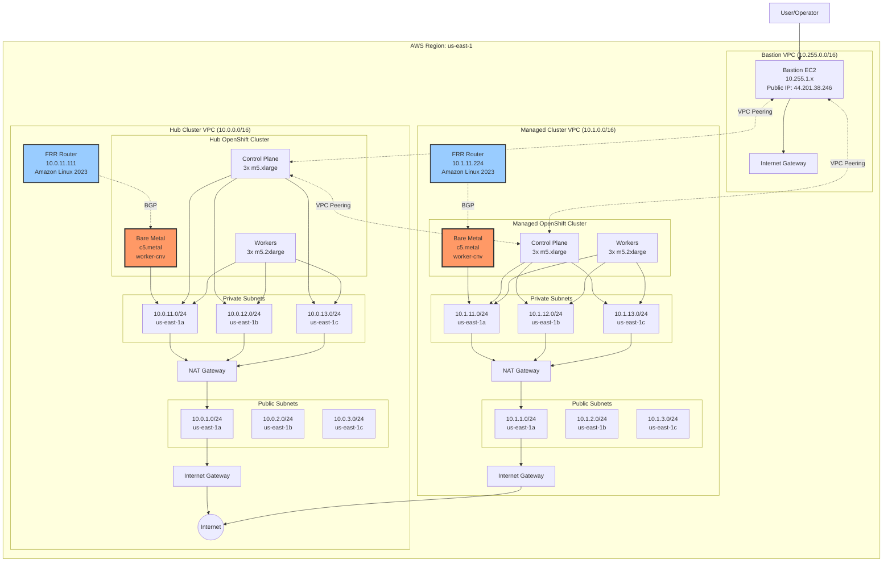
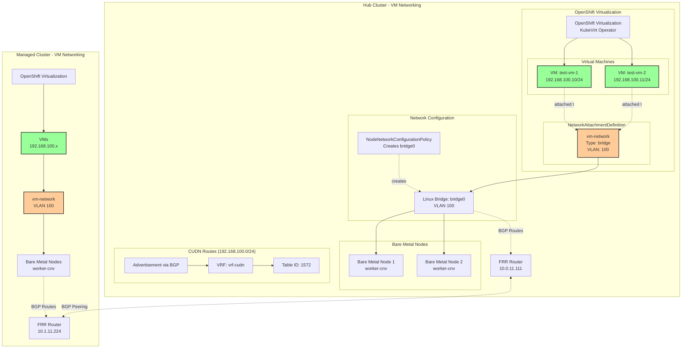
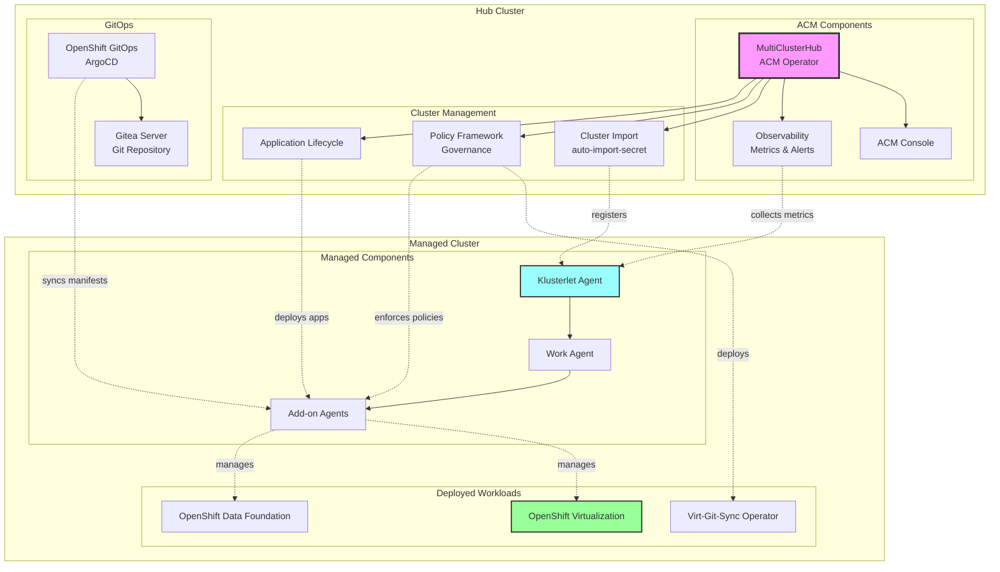
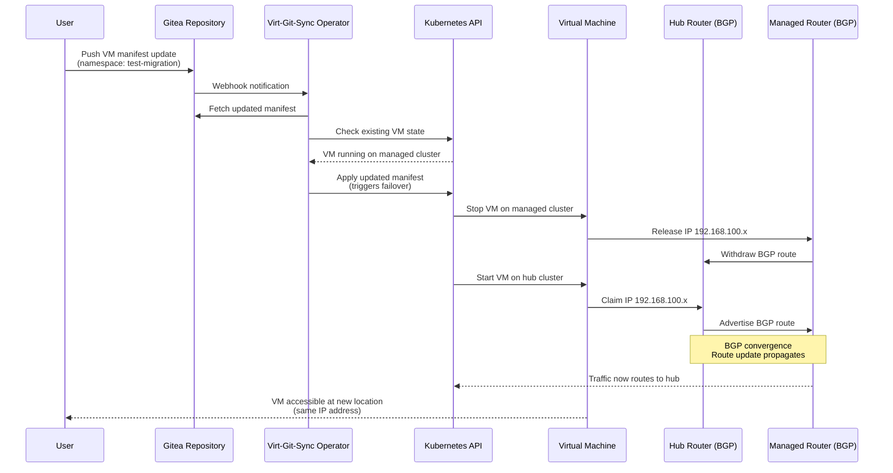
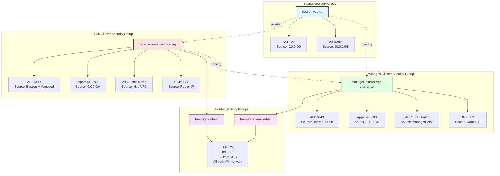
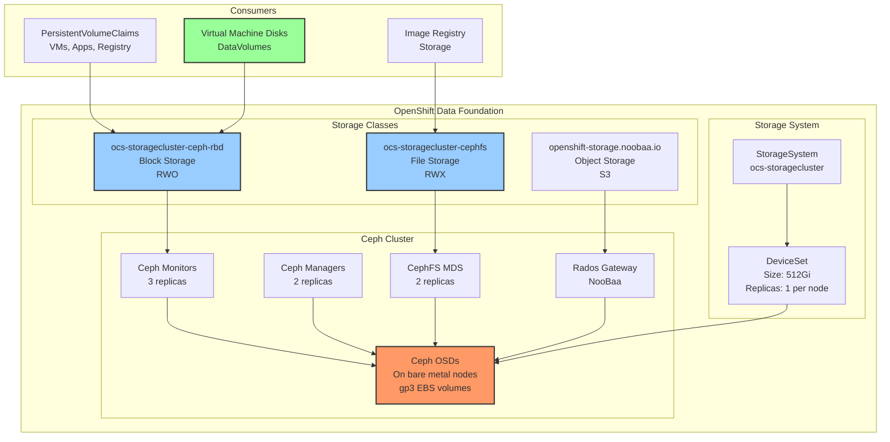

# Architecture Diagrams

## Overall Infrastructure Architecture



## Bare Metal BGP Routing Architecture

```mermaid
graph TB
    subgraph "Hub Cluster - Bare Metal Node Routing"
        subgraph "c5.metal Node (10.0.11.x)"
            BM1[Bare Metal Node<br/>Role: worker-cnv]
            BM1Intf[Primary Interface<br/>ens5]
            BM1GW[Default Gateway<br/>→ 10.0.11.111]
            BM1MC[MachineConfig<br/>98-worker-cnv-bgp-gateway]
            
            BM1MC -.applies to.-> BM1
            BM1 --> BM1Intf
            BM1Intf --> BM1GW
        end
        
        subgraph "FRR Router (10.0.11.111)"
            Router1[EC2 t3.small<br/>Amazon Linux 2023]
            Router1FRR[FRRouting Daemon<br/>BGP + OSPF]
            Router1Fwd[IP Forwarding<br/>Enabled]
            
            Router1 --> Router1FRR
            Router1 --> Router1Fwd
        end
        
        BM1GW --> Router1
        Router1 --> NATGateway[NAT Gateway<br/>10.0.1.x]
        NATGateway --> Internet1((Internet))
        
        subgraph "MachineConfig Details"
            Script[/usr/local/bin/set-gw.sh<br/>NetworkManager Script]
            Service[systemd-bgp-gw.service<br/>Runs on Boot]
            
            Script -.executed by.-> Service
            Service -.configured by.-> BM1MC
        end
    end
    
    subgraph "NetworkManager Configuration Process"
        DetectIntf[Detect Primary Interface<br/>ip route show default]
        GetConn[Get NM Connection<br/>nmcli con show]
        ModifyGW[Modify Gateway<br/>nmcli con modify]
        ApplyConfig[Bring Connection Up<br/>nmcli con up]
        
        DetectIntf --> GetConn
        GetConn --> ModifyGW
        ModifyGW --> ApplyConfig
    end
    
    style BM1 fill:#f96,stroke:#333,stroke-width:3px
    style Router1 fill:#9cf,stroke:#333,stroke-width:2px
    style BM1MC fill:#ff9,stroke:#333,stroke-width:2px
```

## VM Network (CUDN) Architecture



## ACM Hub and Spoke Architecture



## Data Flow: VM Live Migration Simulation



## Component Deployment Flow

```mermaid
graph LR
    subgraph "Phase 1: Prerequisites"
        P1[AWS Quota Check]
        P2[Credentials Validation]
        P3[Ansible Version Check]
    end
    
    subgraph "Phase 2: Infrastructure"
        I1[Create VPCs]
        I2[Create Subnets]
        I3[Configure Routing]
        I4[Deploy Bastion]
        I5[VPC Peering]
        
        I1 --> I2 --> I3 --> I4 --> I5
    end
    
    subgraph "Phase 3: OpenShift Install"
        O1[Generate install-config.yaml]
        O2[Start tmux sessions]
        O3[Deploy Control Plane]
        O4[Deploy Workers]
        O5[Configure OAuth]
        
        O1 --> O2 --> O3 --> O4 --> O5
    end
    
    subgraph "Phase 4: ACM Setup"
        A1[Install ACM Operator]
        A2[Create MultiClusterHub]
        A3[Import Managed Cluster]
        A4[Configure Observability]
        
        A1 --> A2 --> A3 --> A4
    end
    
    subgraph "Phase 5: Bare Metal"
        B1[Create MachineConfig<br/>BGP Gateway]
        B2[Deploy MachineSets<br/>c5.metal]
        B3[Nodes Boot with<br/>BGP Routing]
        
        B1 --> B2 --> B3
    end
    
    subgraph "Phase 6: Storage & Virtualization"
        S1[Deploy ODF Operator]
        S2[Create StorageSystem]
        S3[Deploy CNV Operator]
        S4[Create HyperConverged]
        S5[Configure VM Network]
        
        S1 --> S2 --> S3 --> S4 --> S5
    end
    
    subgraph "Phase 7: GitOps"
        G1[Deploy Gitea]
        G2[Deploy OpenShift GitOps]
        G3[Configure Repositories]
        G4[Deploy Virt-Git-Sync]
        
        G1 --> G2 --> G3 --> G4
    end
    
    P1 & P2 & P3 --> I1
    I5 --> O1
    O5 --> A1
    A4 --> B1
    B3 --> S1
    S5 --> G1
    
    style P1 fill:#e1f5ff
    style I1 fill:#fff5e1
    style O1 fill:#ffe1e1
    style A1 fill:#e1ffe1
    style B1 fill:#f5e1ff
    style S1 fill:#ffe1f5
    style G1 fill:#f5ffe1
```



## Security Groups and Firewall Rules



## Storage Architecture (ODF)


