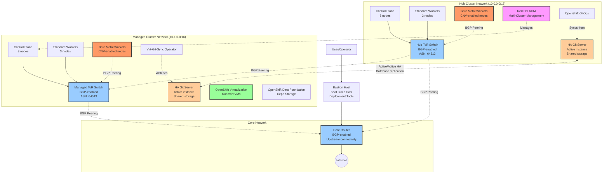
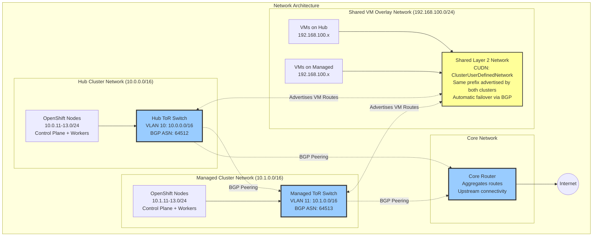
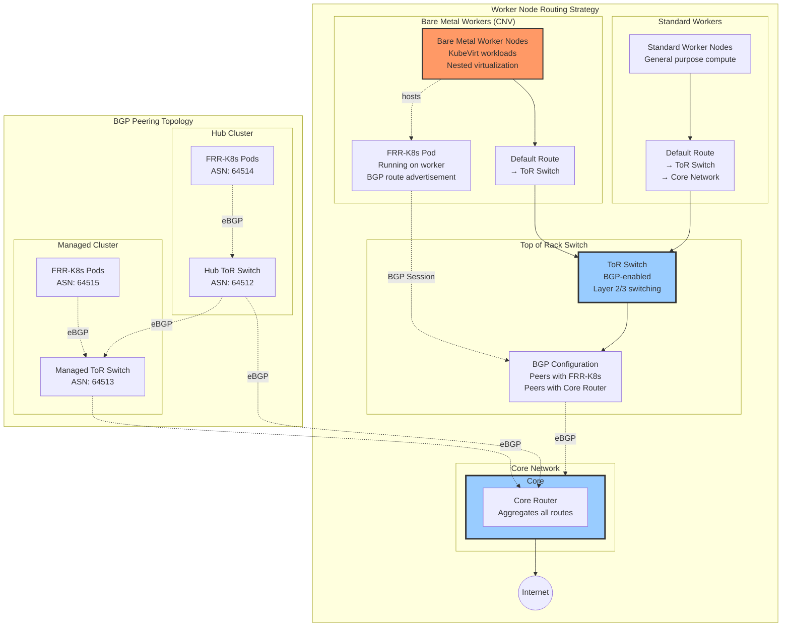
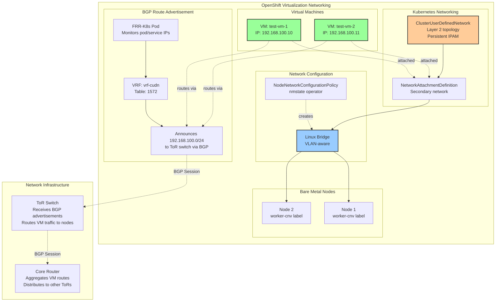
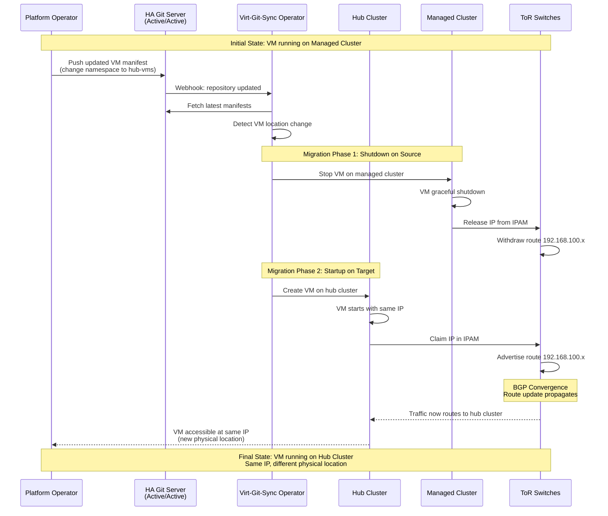
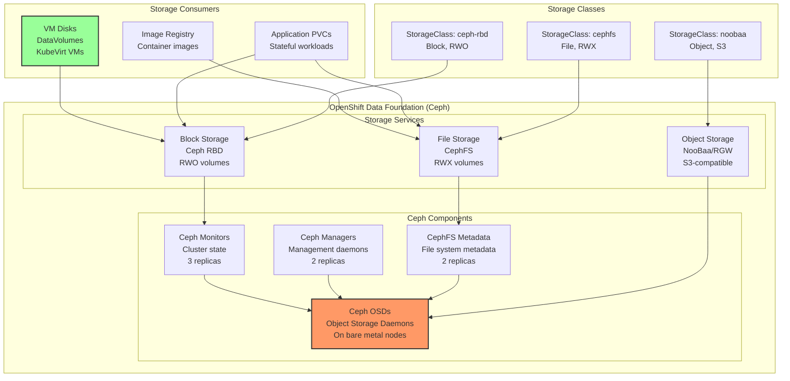
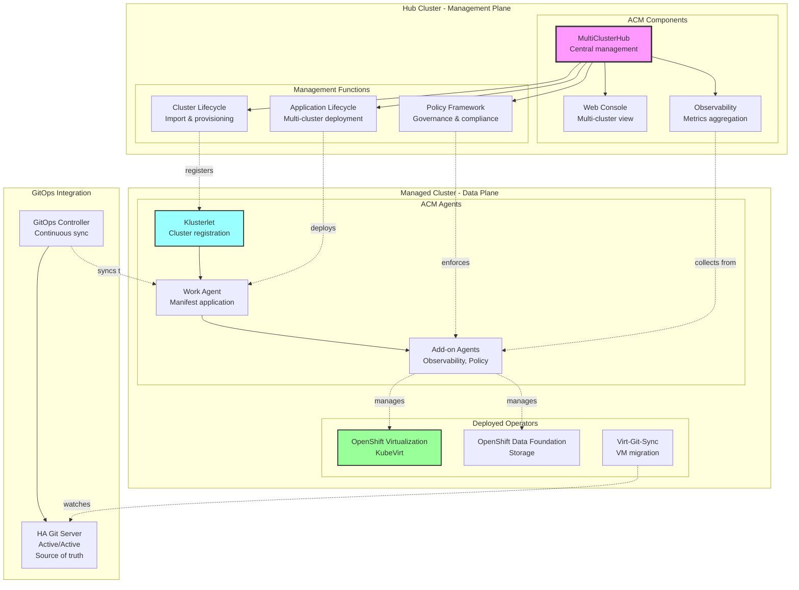

# Logical Architecture (Cloud-Agnostic)

This document provides abstracted architecture diagrams showing the logical components and network topology without cloud provider-specific details.

## High-Level Architecture

## Network Topology

## Routing Architecture

## VM Networking Architecture

## GitOps VM Migration Flow

## Storage Architecture

## Multi-Cluster Management (ACM)

## Key Technologies

### Networking
- **BGP (Border Gateway Protocol)**: Dynamic routing between clusters and routers
- **FRRouting**: Open-source routing software on router instances
- **FRR-K8s**: Kubernetes-native FRR integration for route advertisement
- **CUDN (ClusterUserDefinedNetwork)**: OVN-Kubernetes secondary network feature
- **nmstate**: Declarative network configuration on nodes

### Virtualization
- **OpenShift Virtualization**: KubeVirt-based VM management on Kubernetes
- **DataVolumes**: Persistent storage for VM disks
- **NetworkAttachmentDefinition**: Secondary network attachment for VMs

### Storage
- **Ceph**: Distributed storage system (block, file, object)
- **Rook Operator**: Kubernetes operator for Ceph
- **ODF (OpenShift Data Foundation)**: Enterprise storage platform

### Management
- **Red Hat ACM**: Multi-cluster lifecycle and governance
- **OpenShift GitOps**: ArgoCD-based continuous delivery
- **HA Git Server**: Active/Active Git repository (e.g., Gitea, GitLab, GitHub Enterprise)
- **Virt-Git-Sync**: Custom operator for Git-driven VM migration

## Network Flow Summary

1. **Standard Worker Traffic**: Workers → ToR Switch → Core Router → Internet
2. **Bare Metal Worker Traffic**: Workers → ToR Switch → Core Router → Internet
3. **VM Traffic**: VMs → Linux Bridge → FRR-K8s BGP Advertisement → ToR Switch → Core Router
4. **Shared VM Network Routing (192.168.100.0/24)**: 
   - **Hub cluster** advertises 192.168.100.0/24 → Hub ToR → Core Router
   - **Managed cluster** advertises 192.168.100.0/24 → Managed ToR → Core Router
   - Core Router learns **same prefix from both** clusters
   - **Automatic failover**: If one cluster fails, Core Router switches to remaining path
   - **Zero downtime**: BGP convergence redirects traffic without packet loss
5. **BGP Peering Topology**:
   - FRR-K8s on bare metal nodes ↔ ToR Switch (eBGP)
   - Hub ToR ↔ Core Router (eBGP via GRE tunnel)
   - Managed ToR ↔ Core Router (eBGP via GRE tunnel)
   - Core Router selects best path based on BGP attributes
6. **Management Access**: Operator → Bastion → Core Network → Clusters

## Architecture Abstractions

This logical architecture abstracts away cloud provider-specific implementations:

### AWS Implementation → Logical Equivalent

**Current Production Architecture (2026+):**
- **EC2 c5.metal instances** → Bare metal workers with nested virtualization
- **VPC Route Server** → ToR switch with native AWS BGP routing
- **Transit Gateway** → Core router providing cross-VPC routing
- **Transit Gateway Connect** → GRE tunnels for BGP peering between Core and ToR
- **Route Server BGP sessions** → Direct BGP peering from workers to ToR
- **Dynamic route propagation** → Automatic VPC route table updates
- **AWS NAT Gateway** → Internet egress for nodes
- **Security Groups** → Standard firewall rules (not shown in logical diagrams)

**Legacy Architecture (Optional, backwards compatibility):**
- **EC2 router with dual ENIs + NAT** → ToR switch with BGP capabilities (EC2-based)
- **VPC route table overrides** → Static routes pointing to EC2 router
- **VPC Peering** → Superseded by Transit Gateway

### On-Premises Implementation
This architecture maps directly to traditional data center deployments:
- **Bare metal servers** in racks with CNV workloads
- **ToR switches** (e.g., Cisco Nexus, Arista, Juniper) with BGP support
- **Core router** providing upstream connectivity and inter-rack routing
- **FRR-K8s** running on OpenShift nodes advertising VM routes
- **VLAN segmentation** for network isolation (10.0.0.0/16, 10.1.0.0/16, 192.168.100.0/24)

### Key Benefits of This Approach
1. **Cloud-agnostic**: Same architecture works on AWS, bare metal, or other cloud providers
2. **Standard protocols**: Uses BGP (industry standard) for dynamic routing
3. **No vendor lock-in**: FRRouting is open source, runs anywhere
4. **Scalable**: ToR/Core architecture supports growth (add more racks/clusters)
5. **Portable VMs**: Same IP address as VMs move between clusters (BGP handles routing updates)
6. **Automatic Failover**: Both clusters advertise same CUDN prefix; Core Router provides instant failover
7. **Zero Downtime**: BGP convergence time (<10 seconds) ensures minimal service interruption
8. **Active-Active or Active-Passive**: Flexible deployment based on BGP path selection policies

### HA Git Server Deployment
The architecture shows an **active/active HA Git server** deployment across both clusters:
- **Hub cluster**: Hosts one active instance of the Git server
- **Managed cluster**: Hosts another active instance
- **Shared database**: PostgreSQL with replication for consistency
- **Shared storage**: CephFS (RWX) or object storage for Git repositories
- **Load balanced**: External load balancer or multi-cluster ingress distributes requests
- **GitOps integration**: ArgoCD syncs from hub instance, Virt-Git-Sync watches managed instance
- **Fault tolerance**: If one cluster fails, Git server remains available via the other cluster

**Implementation options**: Gitea, GitLab, GitHub Enterprise, Bitbucket, or any Git server supporting HA deployment
